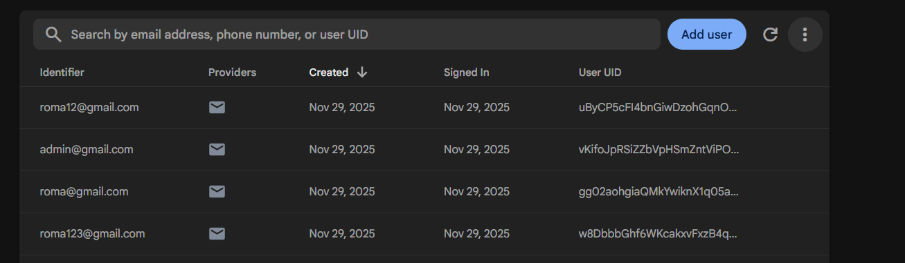

🏨 Room Booking System

Це веб-застосунок для керування готельними номерами та бронюванням з підтримкою авторизації, ролей (admin/user), а також
повноцінного інтерфейсу для клієнтів і адміністраторів.

✅ Що реалізовано

🔐 Реєстрація та вхід користувачів через Firebase
 (Нажаль у Firebase зберігається тільки пароль та пошта не встиг виправити їх щоб зберігалась також
роль та ім'я, готовий доопрацювати якщо ви дасте таку можливість!)

🧭 Автоматична переадресація після логіну/реєстрації

💾 Збереження токена в localStorage

👤 Підтримка ролей: user та admin

🔒 Захищені маршрути (PrivateRoute)

🧠 Відображення функцій редагування/видалення лише для адміна

💬 Повідомлення про помилки через react-toastify

🌐 Структура проєкту на базі React + TypeScript + Redux Toolkit

🎨 UI за допомогою Tailwind CSS + іконки Lucide, Phosphor
